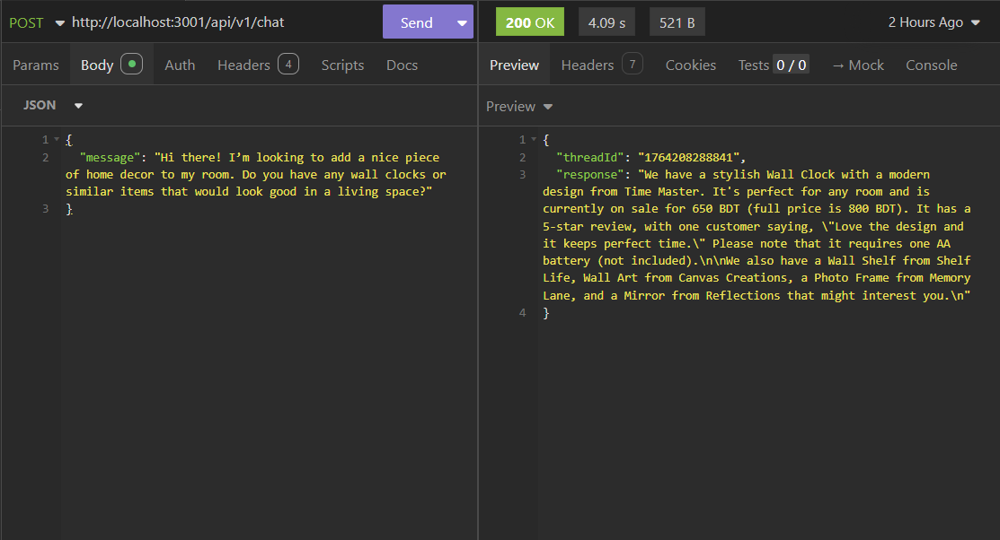
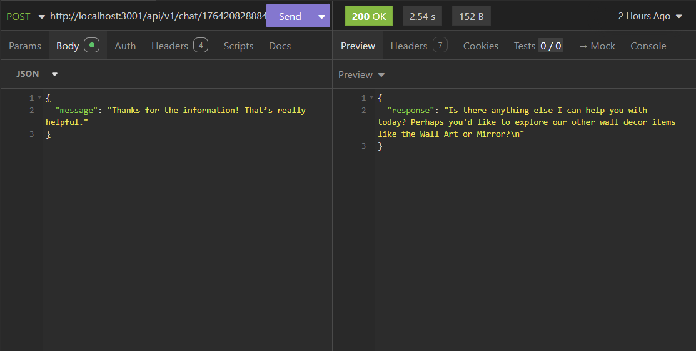

# 🤖🛒 Smart E-commerce AI Agent API

<div align="center">


**This API powers an AI-driven shopping assistant that thinks, adapts, and interacts like a human sales professional.**

</div>

## 📋 <a name="table">Table of Contents</a>

1. 📘 [Introduction](#introduction)
2. ⚙️ [Tech Stack](#tech-stack)
3. ⭐ [Features](#features)
4. 🚀 [Quick Start](#quick-start)
5. 📸 [Demo](#Demo)
6. 🔗 [Links](#Links)

## <a name="introduction">📘 Introduction</a>

Smart E-commerce AI Agent API is a powerful, AI-driven shopping assistant designed to enhance the online shopping experience. It understands user queries, provides personalized recommendations, performs multi-step reasoning, and interacts naturally, just like a human sales associate.

## <a name="tech-stack">⚙️ Tech Stack</a>

- 
- 
- 
- 

## <a name="features">⭐ Features</a>

🧠 **Intelligent Decision Making:** The AI agent makes decisions autonomously, understands context, and performs multi-step reasoning to assist users effectively.

🔍 **Advanced Search Capabilities:** Provides accurate results using vector-based semantic search, text fallback search, and real-time inventory checks.

💬 **Natural Conversations:** Remembers past conversations, keeps thread-based context, and interacts naturally for a smooth user experience.

## <a name="quick-start">🚀 Quick Start</a>

**Prerequisites**

- [Git](https://git-scm.com/)
- [Node.js](https://nodejs.org/)
- [npm](https://www.npmjs.com/)
- [MongoDB](https://www.mongodb.com/)

**Clone the repository**

```bash
git clone https://github.com/Sumit-531/ecommerce-ai-agent.git

cd ecommerce-ai-agent
```

**Installation**

Install the project dependencies using npm:

```bash
npm install
```

**Set Up Environment Variables**

Create a file named .env.local in the root directory of the project and add the required environment variables as shown below:

```env
# PORT
PORT=3001

# ENVIRONMENT
NODE_ENV=development

# DATABASE
DB_URI=

# GOOGLE
GOOGLE_API_KEY=
```

**Seed the Database**

```bash
npm run seed
```

**Running the Project**

```bash
npm run dev
```

**Test the API**

After starting the server, the API will be accessible at:
[http://localhost:3001](http://localhost:3001)
Requests can be made through a web browser or any HTTP client (e.g., Insomnia, Postman) to verify the endpoints.

## <a name="demo">📸 Demo</a>

**Initial Chat Example**


_Example response returned by the API when sending a message to the Smart E-commerce AI Agent._

**Product Inquiry Example**


_Example response returned by the API when asking about product variations._

**Follow-up Chat Example**


_Example response returned by the API after a user thanks the Smart E-commerce AI Agent._

## <a name="links">🔗 Links</a>

- **Node.js** - [https://nodejs.org/en](https://nodejs.org/en)
- **MongoDB** - [https://www.mongodb.com/](https://www.mongodb.com/)
- **LangGraph** - [https://www.langchain.com/langgraph](https://www.langchain.com/langgraph)
